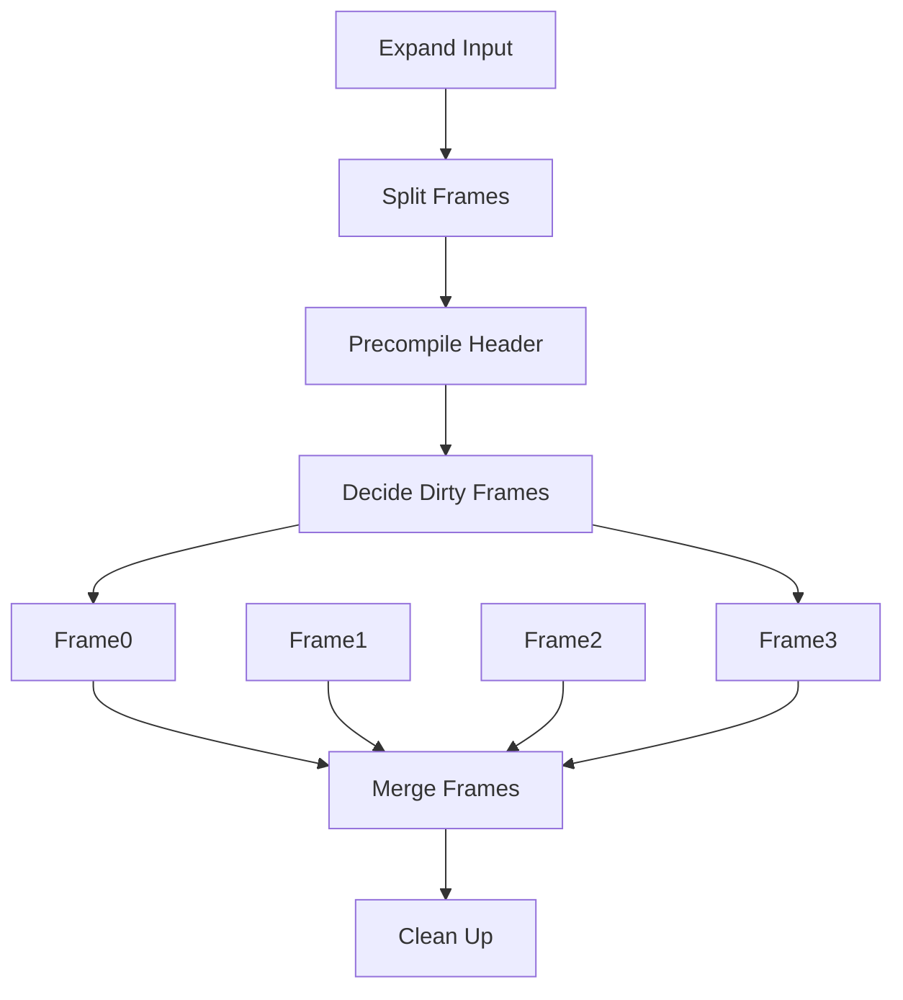

# BeamerBoost

LaTeX `beamer` 文档类的**脏帧渲染**与**并行渲染**的预览级实现，借助于 [`l3build`](https://github.com/latex3/l3build) (lua) 和 [PowerShell](https://docs.microsoft.com/powershell/) 实现。

## 使用方法

```shell
l3build doc
```
以及可以使用 VS Code 预先配置的 `Recipe: preview`。

为了使用并行渲染，请安装 PowerShell 7 并添加到路径（`pwsh` 在命令行中可以运行，以及需要允许脚本运行），否则将回退到非并行渲染。

```shell
l3build clean
```
将清理所有的临时文件。

## 概览




## 测评

在四逻辑核机器上测试。

|| BeamerBoost | LaTeXmk | BeamerBoost 修改一帧 | LaTeXmk 修改一帧 |
|---|---|---|---|---|
|帧渲染完成时间(s)| 45 | | 8 | |
|全部合成完成时间(s)| 57 | 16 | 14 | 14 |

从该表可以看出，使用 BeamerBoost 不能够减少初始化时间（甚至成倍的增长了），但是通过脏区渲染，可以较早地拿到所有帧的数据，虽然最后的合并阶段仍然同样依赖于 I/O 的速度，但对于构建一些实用软件而言，每次渲染预览少了几秒，按照每个文件可能会构建 100 次计算，将会减少 10 分钟的构建时间。

| | BeamerBoost (每帧渲染两次) | BeamerBoost (每帧渲染两次) 修改一帧 |
|---|---|---|
|帧渲染完成时间(s)| 80 | 10 |
|全部合成完成时间(s)| 93 | 16 |

在 `build.lua` 文件中可以更改 `secondpass` 参数用于编译两次之用，用于编译目录等用途。该表依然显示如果不进行合并，时间仍然会有节省。并行渲染对于大型多核服务器可以更好地发挥其效能，这种拆分工作的方式也可以用于分布式计算。

## 目前缺陷

- `allowframebreak` 可能会导致页码错误（无法预估）
- 仅支持 `pdflatex`，因为 `xelatex` 和 `lualatex` 的 OpenType 字体载入无法通过 `mylatexformat` 缓存，但是愿景依然是在预览完毕后，再通过较慢的方式渲染一遍。为了获得全平台中文支持（Linux 或 Mac），你可能需要使用 `CJK` 手动方法。（事实上 `xelatex` 在类 Unix 平台上的速度要比 Windows 上快得多，可以不需要再用这种并行渲染的方式。）
```latex
\documentclass{beamer}
\usepackage{CJKutf8}
\begin{document}
\begin{CJK}{UTF8}{gbsn}
中文内容
\end{CJK}
\end{document}
```
- 不支持任何跨帧的 `group` （`CJK` 除外）。
- 需要工整的代码，也就是一行只有一个命令。
- 太过复杂的代码可能无法解析，请保证代码能够用正常的编译方式正常通过。
- 文档类中预置的 `\AtBeginPart`, `\AtBeginSection`, `\AtBeginSubsection`, `\AtBeginSubsubsection` 命令将会被全部清空，请显式地在主文件添加相关命令，并且不区分是否带星号的版本（可选参数无效），这类命令的最后一个大括号必须单独占一行。

## 相关项目

[AutoBeamer](https://github.com/LogCreative/AutoBeamer) 用于转换 Markdown 为 beamer 代码。

[ReportBoost](https://github.com/LogCreative/ReportBoost) 用于准备一个开箱即用的预编译环境。
